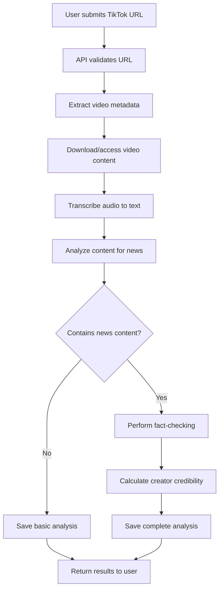
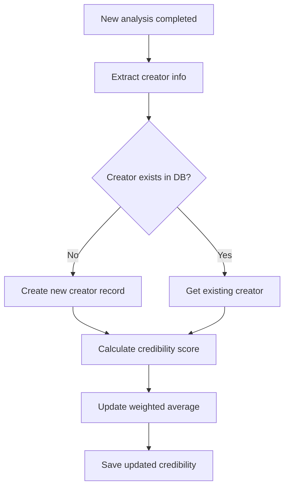
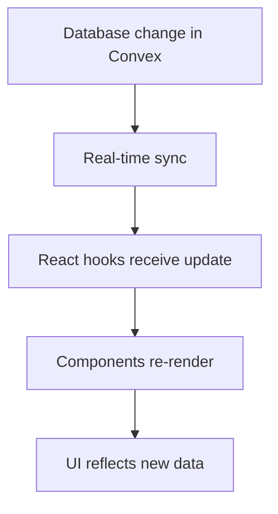

# Architecture Guide

This guide provides an overview of the Checkmate project architecture, technologies used, and how different components work together.

## Project Overview

Checkmate is a fact-checking application that analyzes TikTok videos for misinformation and tracks content creator credibility. The application provides:

- Video transcription and analysis
- Fact-checking against reliable sources
- Creator credibility scoring
- User dashboard for saved analyses
- Browser extension for quick analysis

## Technology Stack

### Frontend

- **Next.js 15** - React framework with App Router
- **TypeScript** - Type safety and developer experience
- **Tailwind CSS** - Utility-first CSS framework
- **shadcn/ui** - Component library built on Radix UI
- **Clerk** - Authentication and user management

### Backend

- **Convex** - Serverless backend with real-time database
- **OpenAI API** - AI-powered transcription and analysis
- **Firecrawl API** - Web scraping for fact-checking sources

### Mobile

- **Flutter** - Cross-platform mobile application
- **Dart** - Programming language for Flutter

### Browser Extension

- **Vanilla JavaScript** - Content scripts and background workers
- **Chrome Extension API** - Browser integration

## Project Structure

```
checkmate/
├── app/                    # Next.js App Router pages
├── components/             # Reusable React components
├── lib/                   # Utilities and custom hooks
├── convex/                # Backend database and API functions
├── tools/                 # AI analysis and fact-checking logic
├── types/                 # TypeScript type definitions
├── checkmate_wrapper_flutter/  # Flutter mobile app
├── checkmate-browser-extension/ # Browser extension
└── docs/                  # Documentation (this guide)
```

### App Directory (`app/`)

Next.js App Router structure with:

```
app/
├── api/transcribe/        # API routes for video analysis
├── creator/[creatorId]/   # Creator profile pages
├── news/                  # News analysis dashboard
├── sign-in/              # Authentication pages
├── sign-up/
├── layout.tsx            # Root layout
└── page.tsx              # Home page
```

### Components Directory (`components/`)

Organized by feature and responsibility:

```
components/
├── ui/                   # Base UI components (shadcn/ui)
├── analysis/            # Analysis-related components
├── creator/             # Creator profile components
├── news/               # News dashboard components
├── header.tsx          # Site header
├── footer.tsx          # Site footer
└── Providers.tsx       # Context providers
```

### Lib Directory (`lib/`)

Utilities, hooks, and shared logic:

```
lib/
├── hooks/              # Custom React hooks
├── api-error.ts       # Error handling utilities
├── config.ts          # Environment configuration
├── logger.ts          # Logging utilities
├── rate-limiter.ts    # Rate limiting logic
├── translations.ts    # Internationalization
├── utils.ts           # General utilities
└── validation.ts      # Input validation schemas
```

### Convex Directory (`convex/`)

Backend database and API functions:

```
convex/
├── _generated/         # Auto-generated types and API
├── schema.ts          # Database schema definition
├── tiktokAnalyses.ts  # Analysis CRUD operations
├── users.ts           # User management
├── auth.config.ts     # Authentication configuration
└── http.ts            # HTTP endpoints
```

### Tools Directory (`tools/`)

AI analysis and processing logic:

```
tools/
├── content-analysis.ts  # Content analysis utilities
├── fact-checking.ts    # Fact-checking logic
├── helpers.ts          # Analysis helper functions
├── tiktok-analysis.ts  # TikTok-specific analysis
└── index.ts           # Exported tools
```

## Data Flow

### 1. Video Analysis Flow



### 2. Creator Credibility Flow



### 3. Real-time Data Sync



## Component Architecture

### Component Hierarchy

```
App
├── Providers (Convex, Clerk, Theme)
├── Header
├── Page Content
│   ├── Hero Section
│   ├── Analysis Form
│   ├── Results Display
│   └── Creator Profiles
└── Footer
```

### State Management

1. **Convex Hooks** - Database state and real-time sync
2. **React Context** - Global state (theme, language)
3. **Local State** - Component-specific state (forms, UI)
4. **URL State** - Navigation and page parameters

### Component Patterns

#### 1. Container/Presenter Pattern

```typescript
// Container component handles data and logic
function AnalysisContainer({ analysisId }: { analysisId: string }) {
  const analysis = useTikTokAnalysisById(analysisId);
  const deleteAnalysis = useDeleteTikTokAnalysis();

  if (!analysis) return <LoadingSpinner />;

  return (
    <AnalysisPresenter
      analysis={analysis}
      onDelete={() => deleteAnalysis({ analysisId })}
    />
  );
}

// Presenter component handles display only
function AnalysisPresenter({ analysis, onDelete }) {
  return (
    <div>
      <h2>{analysis.metadata?.title}</h2>
      <FactCheckDisplay factCheck={analysis.factCheck} />
      <button onClick={onDelete}>Delete</button>
    </div>
  );
}
```

#### 2. Compound Components

```typescript
function AnalysisCard({ analysis }) {
  return (
    <Card>
      <AnalysisCard.Header analysis={analysis} />
      <AnalysisCard.Content analysis={analysis} />
      <AnalysisCard.Actions analysis={analysis} />
    </Card>
  );
}

AnalysisCard.Header = ({ analysis }) => (
  <CardHeader>
    <CardTitle>{analysis.metadata?.title}</CardTitle>
  </CardHeader>
);
```

## API Architecture

### REST Endpoints

**`/api/transcribe`** - Main analysis endpoint

- **POST** - Analyze TikTok video
- **Input:** `{ url: string }`
- **Output:** Analysis results with transcription, metadata, and fact-check

### Convex Functions

**Queries** (read-only):

- `getUserTikTokAnalyses` - Get user's analyses
- `getAllAnalyses` - Get all analyses (admin)
- `getContentCreator` - Get creator info
- `getTopCreatorsByCredibility` - Get top creators

**Mutations** (write operations):

- `saveTikTokAnalysis` - Save new analysis
- `deleteTikTokAnalysis` - Delete analysis
- `updateCreatorCredibilityRating` - Update creator rating
- `addCreatorComment` - Add creator comment

### Error Handling

```typescript
// API Error Types
enum ApiErrorCode {
  INVALID_URL = "INVALID_URL",
  TIKTOK_FETCH_FAILED = "TIKTOK_FETCH_FAILED",
  TRANSCRIPTION_FAILED = "TRANSCRIPTION_FAILED",
  FACT_CHECK_FAILED = "FACT_CHECK_FAILED",
  RATE_LIMITED = "RATE_LIMITED",
  // ...
}

// Structured error responses
interface ApiError {
  code: ApiErrorCode;
  message: string;
  context?: Record<string, unknown>;
}
```

## Security Architecture

### Authentication Flow

1. **Clerk Integration** - OAuth and email/password
2. **JWT Tokens** - Secure session management
3. **Convex Auth** - Backend authentication verification

```typescript
// Protected API route
export async function POST(request: Request) {
  const { userId } = auth();
  if (!userId) {
    return NextResponse.json({ error: "Unauthorized" }, { status: 401 });
  }

  // Process authenticated request
}

// Protected Convex function
export const protectedMutation = mutation({
  handler: async (ctx, args) => {
    const identity = await ctx.auth.getUserIdentity();
    if (!identity) {
      throw new Error("Authentication required");
    }
    // ...
  },
});
```

### Data Security

1. **Input Validation** - Zod schemas for all inputs
2. **Rate Limiting** - Per-user request limits
3. **CORS Configuration** - Restricted origins
4. **API Key Security** - Environment-based configuration

## Performance Architecture

### Optimization Strategies

1. **React Optimizations**

   - Lazy loading with `React.lazy()`
   - Memoization with `useMemo` and `useCallback`
   - Virtual scrolling for large lists

2. **Database Optimizations**

   - Indexed queries in Convex
   - Pagination for large datasets
   - Real-time subscriptions

3. **Caching Strategy**

   - Browser caching for static assets
   - API response caching
   - Convex automatic caching

4. **Code Splitting**
   - Route-based splitting with Next.js
   - Component-level splitting
   - Dynamic imports

### Monitoring

```typescript
// Performance monitoring
import { logger } from "@/lib/logger";

export async function processVideo(url: string) {
  const startTime = Date.now();

  try {
    const result = await analyzeVideo(url);

    logger.info("Video processing completed", {
      duration: Date.now() - startTime,
      url,
      success: true,
    });

    return result;
  } catch (error) {
    logger.error("Video processing failed", {
      duration: Date.now() - startTime,
      url,
      error: error.message,
    });
    throw error;
  }
}
```

## Development Workflow

### Local Development Setup

1. **Clone repository**

```bash
git clone https://github.com/your-org/checkmate
cd checkmate
```

2. **Install dependencies**

```bash
npm install
```

3. **Configure environment**

```bash
cp .env.example .env.local
# Add required API keys and configuration
```

4. **Start development servers**

```bash
# Start Convex backend
npx convex dev

# Start Next.js frontend (in another terminal)
npm run dev
```

### Code Quality

- **ESLint** - Code linting and style enforcement
- **TypeScript** - Type checking and IntelliSense
- **Prettier** - Code formatting
- **Husky** - Git hooks for quality gates

### Testing Strategy

1. **Unit Tests** - Component and utility testing
2. **Integration Tests** - API and database testing
3. **E2E Tests** - Full user workflow testing
4. **Type Testing** - TypeScript compilation

## Deployment Architecture

### Frontend Deployment (Vercel)

- **Build Process** - Next.js static generation
- **Edge Functions** - API routes deployed globally
- **CDN Distribution** - Static assets cached globally

### Backend Deployment (Convex)

- **Serverless Functions** - Auto-scaling backend
- **Global Distribution** - Edge-deployed database
- **Real-time Sync** - WebSocket connections

### Environment Configuration

```typescript
// Production environment variables
{
  OPENAI_API_KEY: "sk-...",
  FIRECRAWL_API_KEY: "fc-...",
  CLERK_SECRET_KEY: "sk_...",
  CONVEX_DEPLOYMENT: "production-deployment",
  NEXT_PUBLIC_CONVEX_URL: "https://...",
}
```

## Mobile Architecture (Flutter)

### Flutter Integration

- **Platform Channels** - Native platform integration
- **HTTP Client** - API communication with backend
- **State Management** - Provider pattern for state
- **Navigation** - Flutter navigation 2.0

### Shared Backend

The Flutter app uses the same Convex backend as the web application, ensuring data consistency across platforms.

## Browser Extension Architecture

### Extension Components

1. **Content Scripts** - Injected into TikTok pages
2. **Background Script** - Service worker for processing
3. **Popup** - Extension UI interface
4. **Manifest** - Extension configuration

### Communication Flow

```
TikTok Page → Content Script → Background Script → API → Results → Popup
```

## Scaling Considerations

### Horizontal Scaling

1. **Serverless Architecture** - Auto-scaling backend functions
2. **CDN Distribution** - Global content delivery
3. **Database Sharding** - Convex handles automatically

### Performance Bottlenecks

1. **AI Processing** - OpenAI API rate limits
2. **Video Download** - Large file processing
3. **Fact-checking** - External API dependencies

### Monitoring and Alerting

- **Error Tracking** - Structured error logging
- **Performance Metrics** - Response time monitoring
- **Usage Analytics** - User behavior tracking

This architecture guide provides a comprehensive overview of how Checkmate is structured and how its components interact. For more specific implementation details, refer to the individual guides for [Hooks](./HOOKS_GUIDE.md), [Database](./DATABASE_GUIDE.md), and other system components.
