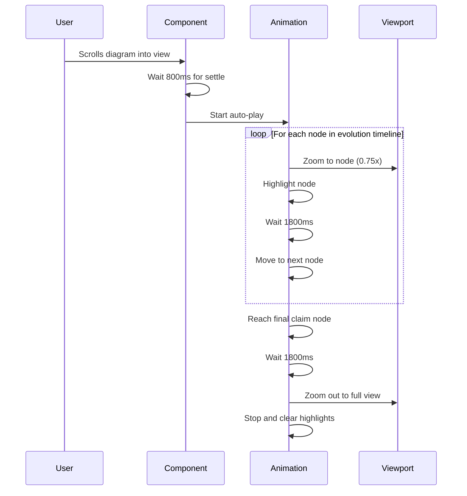

# Auto-Play Animation Feature

## Overview

The origin tracing diagram automatically plays an introductory animation when it first loads, guiding users through the complete evolution timeline from origin to claim, then zooming out to show the full context.

## Animation Flow



## Timeline Sequence

### 1. Component Mount (t=0ms)
- Diagram renders with all nodes visible
- Graph is in default zoom state (0.35x)

### 2. Auto-Play Initialization (t=800ms)
- Hook checks for evolution timeline section
- Collects node IDs in sequence: Origin → Evolution Steps → Claim
- Sets animation state to active

### 3. Node-by-Node Animation (starting t=800ms)
For each node in the evolution timeline:
- **Duration per node**: 1800ms
- **Zoom level**: 0.75x (zoomed in to focus on node)
- **Transition**: 400ms smooth pan/zoom
- **Highlight**: Node gets blue glow and scale effect

```
Node 0 (Origin):     t=800ms  - t=2600ms
Node 1 (Evolution):  t=2600ms - t=4400ms
Node 2 (Evolution):  t=4400ms - t=6200ms
...
Node N (Claim):      t=???ms  - t=???ms + 1800ms
```

### 4. Final Zoom Out (after last node)
- **Pause**: 500ms on final claim node
- **Zoom transition**: 800ms smooth zoom out
- **Final state**: Full diagram visible at fit-view zoom (~0.35x)
- **Highlights**: All removed
- **Navigation**: Evolution section expanded in sidebar

## Implementation Details

### Auto-Play Trigger

```typescript
// Runs once on mount
useEffect(() => {
  if (hasAutoPlayedRef.current || nodes.length === 0) return;
  
  // Find evolution timeline
  const evolutionSection = navSections.find(s => s.id === 'evolution');
  const allNodeIds = collectEvolutionNodeIds(evolutionSection);
  
  // Mark as played (prevents re-triggering)
  hasAutoPlayedRef.current = true;
  
  // Start after 800ms delay
  setTimeout(() => {
    setAnimatingNodes(allNodeIds);
    setIsAnimating(true);
  }, 800);
}, [nodes.length, navSections]);
```

### Animation Loop Logic

```typescript
// For each animation step
if (isLastNode) {
  // Final node: pause then zoom out
  setTimeout(() => {
    setIsAnimating(false);
    clearHighlights();
    
    setTimeout(() => {
      fitView({ duration: 800, padding: 0.15 });
    }, 500);
  }, animationSpeed);
} else {
  // Continue to next node
  setTimeout(() => {
    setCurrentAnimationIndex(index + 1);
  }, animationSpeed);
}
```

## User Interactions

### During Auto-Play

| Action | Result |
|--------|--------|
| Click on pane | Animation stops, highlights cleared |
| Click on node | Animation stops, focus on clicked node |
| Click nav item | Animation stops, custom animation starts |
| Pan/zoom manually | Animation continues (viewport syncs) |

### After Auto-Play

- User can manually trigger animations via navigation sidebar
- Clicking evolution section replays the sequence
- Individual node clicks zoom to that specific node
- Auto-play will NOT re-trigger on subsequent renders

## Configuration

### Timing Constants

```typescript
const animationSpeed = 1800;      // ms per node
const autoPlayDelay = 800;        // ms before starting
const transitionDuration = 400;   // ms for pan/zoom
const finalPause = 500;           // ms before zoom out
const zoomOutDuration = 800;      // ms for final zoom
```

### Zoom Levels

```typescript
const zoomDuringAnimation = 0.75; // Focused on single node
const defaultZoom = 0.35;         // Full diagram view
const minZoom = 0.2;              // User can zoom out further
const maxZoom = 1.2;              // User can zoom in further
```

## Visual Example

### Step-by-Step Progression

```
t=0ms: Initial Load
┌─────────────────────────────────────┐
│  [All clusters visible at 0.35x]    │
│  ● ● ● → ●                          │
│      ▲                               │
│    ●   ●                            │
│      ▼                               │
│    ●   ●                            │
└─────────────────────────────────────┘

t=800ms: Focus on Origin
┌─────────────────────────────────────┐
│      [Zoomed to 0.75x]              │
│                                      │
│         ⦿ Origin                    │
│        (highlighted)                │
│                                      │
└─────────────────────────────────────┘

t=2600ms: Focus on Evolution Step 1
┌─────────────────────────────────────┐
│      [Zoomed to 0.75x]              │
│                                      │
│      ⦿ Evolution Step 1             │
│     (highlighted)                   │
│                                      │
└─────────────────────────────────────┘

t=N+1800ms: Focus on Claim (last)
┌─────────────────────────────────────┐
│      [Zoomed to 0.75x]              │
│                                      │
│      ⦿ Current Claim                │
│     (highlighted)                   │
│                                      │
└─────────────────────────────────────┘

t=N+3100ms: Zoom Out (final state)
┌─────────────────────────────────────┐
│  [All clusters visible at 0.35x]    │
│  ● ● ● → ●                          │
│      ▲                               │
│    ●   ●                            │
│      ▼                               │
│    ●   ●                            │
└─────────────────────────────────────┘
```

## Benefits

1. **Guided Introduction**: New users immediately understand the flow
2. **Attention Direction**: Focuses user on key narrative path
3. **Context Provision**: Ends with full overview of all relationships
4. **Professional Polish**: Creates engaging first impression
5. **Non-Intrusive**: Runs once, can be interrupted anytime

## Edge Cases

- **No evolution timeline**: Auto-play skips silently
- **Single node**: Plays through single node then zooms out
- **User interrupts**: Cleanly stops, no orphaned timers
- **Fast navigation**: hasAutoPlayedRef prevents double-trigger
- **Slow render**: 800ms delay ensures component is ready

