# Container Breakout Effect - Visual Explanation

## Overview

The Origin Tracing Diagram uses a **negative margin technique** to expand beyond its parent container boundaries when scrolled into view. This creates an immersive "pop-out" effect that draws attention to the visualization.

## The Challenge

When a component is nested inside containers with constrained widths, simply increasing the width doesn't help:

```
┌──────────────────────────────────────┐
│  Page Container (max-width: 1200px) │
│                                      │
│  ┌────────────────────────────────┐ │
│  │  Content Container (padding)   │ │
│  │                                │ │
│  │  ┌──────────────────────────┐ │ │
│  │  │  Diagram (width: 115%)   │ │ │  ❌ Can't grow!
│  │  │  Constrained by parent   │ │ │
│  │  └──────────────────────────┘ │ │
│  │                                │ │
│  └────────────────────────────────┘ │
│                                      │
└──────────────────────────────────────┘
```

## The Solution: Negative Margins

By using negative margins, the diagram can "escape" its container:

```
┌──────────────────────────────────────┐
│  Page Container (max-width: 1200px) │
│                                      │
│  ┌────────────────────────────────┐ │
│  │  Content Container (padding)   │ │
│  │                                │ │
┌─┼──┼────────────────────────────────┼─┼─┐
│ │  │  Diagram (width: 115%)        │ │ │  ✅ Breaks out!
│ │  │  Negative margins: -7.5%      │ │ │
└─┼──┼────────────────────────────────┼─┼─┘
│  │    each side                     │ │
│  │                                  │ │
│  └──────────────────────────────────┘ │
│                                        │
└────────────────────────────────────────┘
```

## Step-by-Step Animation

### State 1: Normal (widthScale = 1.0)

```
Diagram Properties:
  width: 100%
  marginLeft: 0%
  marginRight: 0%
  
┌─────────────────────────────────────┐
│  Parent Container                   │
│  ┌───────────────────────────────┐  │
│  │  Diagram                      │  │
│  └───────────────────────────────┘  │
└─────────────────────────────────────┘
```

### State 2: Expanding (widthScale = 1.075)

```
Diagram Properties:
  width: 107.5%
  marginLeft: -3.75%
  marginRight: -3.75%
  
┌─────────────────────────────────────┐
│  Parent Container                   │
┌┼────────────────────────────────────┼┐
││  Diagram (growing...)              ││
└┼────────────────────────────────────┼┘
│  ◄─ 3.75% ─►             ◄─ 3.75% ─►│
└─────────────────────────────────────┘
```

### State 3: Fully Expanded (widthScale = 1.15)

```
Diagram Properties:
  width: 115%
  marginLeft: -7.5%
  marginRight: -7.5%
  
┌─────────────────────────────────────┐
│  Parent Container                   │
┌┼──────────────────────────────────────┼┐
││  Diagram (fully expanded)            ││
└┼──────────────────────────────────────┼┘
│  ◄─── 7.5% ─►          ◄─── 7.5% ───►│
└─────────────────────────────────────┘
```

## Code Implementation

```typescript
// In OriginTracingDiagram.tsx

// 1. Get widthScale from hook (1.0 normal, 1.15 expanded)
const { widthScale } = useScrollExpansion({
  containerRef,
  expansionPercentage: 15,
});

// 2. Calculate how much to expand
const expansionAmount = (widthScale - 1) * 100;
// Examples:
//   widthScale = 1.0  → expansionAmount = 0%
//   widthScale = 1.15 → expansionAmount = 15%

// 3. Calculate negative margin (half on each side)
const negativeMargin = isFullscreen ? 0 : -expansionAmount / 2;
// Examples:
//   expansionAmount = 0%  → negativeMargin = 0%
//   expansionAmount = 15% → negativeMargin = -7.5%

// 4. Apply to container
<div
  style={{
    width: `${widthScale * 100}%`,              // Total width
    maxWidth: `calc(100% + ${expansionAmount}%)`, // Allow overflow
    marginLeft: `${negativeMargin}%`,           // Extend left
    marginRight: `${negativeMargin}%`,          // Extend right
    transition: 'width 600ms, margin 600ms',    // Animate smoothly
    position: 'relative',                       // Maintain flow
  }}
>
  {/* Diagram content */}
</div>
```

## Animation Timeline

```mermaid
gantt
    title Scroll Expansion Animation (600ms)
    dateFormat X
    axisFormat %L ms

    section Width
    100% to 115% :a1, 0, 600
    
    section Left Margin
    0% to -7.5% :a2, 0, 600
    
    section Right Margin
    0% to -7.5% :a3, 0, 600
    
    section Visual Effect
    Normal State :milestone, 0, 0
    Expanding :active, 0, 600
    Expanded State :milestone, 600, 600
```



## Responsive Behavior

The breakout effect works across different screen sizes:

### Desktop (1440px viewport)

```
┌──────────────────────────────────────────────┐
│  Page (1440px)                               │
│  ┌────────────────────────────────────────┐ │
│  │  Container (1200px max-width)          │ │
┌──┼──┼────────────────────────────────────────┼─┼──┐
│  │  │  Diagram (1380px when expanded)      │ │  │
│  │  │  Extends 90px on each side           │ │  │
└──┼──┼────────────────────────────────────────┼─┼──┘
│  │                                            │ │
│  └────────────────────────────────────────────┘ │
└──────────────────────────────────────────────────┘
```

### Tablet (768px viewport)

```
┌───────────────────────────────────┐
│  Page (768px)                     │
│  ┌─────────────────────────────┐ │
│  │  Container (padding: 16px)  │ │
┌──┼──┼─────────────────────────────┼─┼──┐
│  │  │  Diagram (~863px expanded) │ │  │
│  │  │  Extends ~56px each side   │ │  │
└──┼──┼─────────────────────────────┼─┼──┘
│  │                                 │ │
│  └─────────────────────────────────┘ │
└───────────────────────────────────────┘
```

### Mobile (375px viewport)

```
┌──────────────────────┐
│  Page (375px)        │
│  ┌────────────────┐ │
┌──┼──┼──────────────┼─┼──┐
│  │  │  Diagram    │ │  │
│  │  │  (~431px)   │ │  │
└──┼──┼──────────────┼─┼──┘
│  │                  │ │
│  └──────────────────┘ │
└──────────────────────────┘
```

## Key Advantages

1. **Visual Impact**: Creates an engaging "pop-out" effect
2. **More Space**: Diagram gets actual additional screen real estate
3. **Smooth**: Width and margins animate together perfectly
4. **Centered**: Negative margins keep it visually centered
5. **Reversible**: Returns to normal state when scrolled away
6. **Responsive**: Works across all screen sizes
7. **No Layout Break**: Doesn't affect other page elements

## Comparison: Alternative Approaches

### ❌ Just Increasing Width

```typescript
// Problem: Can't exceed parent boundaries
style={{ width: '115%' }}
// Result: Still constrained to parent container
```

### ❌ Position Absolute

```typescript
// Problem: Breaks document flow, requires complex positioning
style={{ position: 'absolute', width: '115%', left: '-7.5%' }}
// Result: Other elements overlap, layout breaks
```

### ✅ Negative Margins (Our Approach)

```typescript
// Solution: Extends beyond parent while maintaining flow
style={{
  width: '115%',
  marginLeft: '-7.5%',
  marginRight: '-7.5%',
  position: 'relative'
}}
// Result: Smoothly expands, stays centered, maintains layout
```

## Browser Compatibility

- **Chrome/Edge**: ✅ Full support
- **Firefox**: ✅ Full support  
- **Safari**: ✅ Full support
- **Mobile browsers**: ✅ Full support

The technique uses standard CSS properties that have universal browser support.

## Performance

- **Layout recalculation**: Minimal (only affects diagram container)
- **Paint**: Hardware-accelerated via CSS transitions
- **Reflow**: Contained to diagram's vicinity
- **60fps**: Smooth animation on all modern devices

## Accessibility

- **Screen readers**: Unaffected by visual expansion
- **Keyboard navigation**: Works normally
- **Focus management**: Maintains proper focus flow
- **Reduced motion**: Could respect `prefers-reduced-motion` (future enhancement)

## Future Enhancements

1. **Respect prefers-reduced-motion**:
   ```typescript
   const prefersReducedMotion = 
     window.matchMedia('(prefers-reduced-motion: reduce)').matches;
   const duration = prefersReducedMotion ? 0 : 600;
   ```

2. **Variable expansion amount by screen size**:
   ```typescript
   const expansionPercentage = 
     viewport < 768 ? 10 : viewport < 1024 ? 15 : 20;
   ```

3. **User preference setting**:
   ```typescript
   const userPreference = useUserSettings('diagramExpansion');
   const expansionPercentage = userPreference ?? 15;
   ```

## Related Documentation

- [SCROLL_EXPANSION.md](./SCROLL_EXPANSION.md) - Full scroll expansion feature docs
- [AUTO_PLAY_ANIMATION.md](./AUTO_PLAY_ANIMATION.md) - Diagram auto-play animation
- [OriginTracingDiagram.tsx](../components/analysis/origin-tracing-diagram/OriginTracingDiagram.tsx) - Implementation

