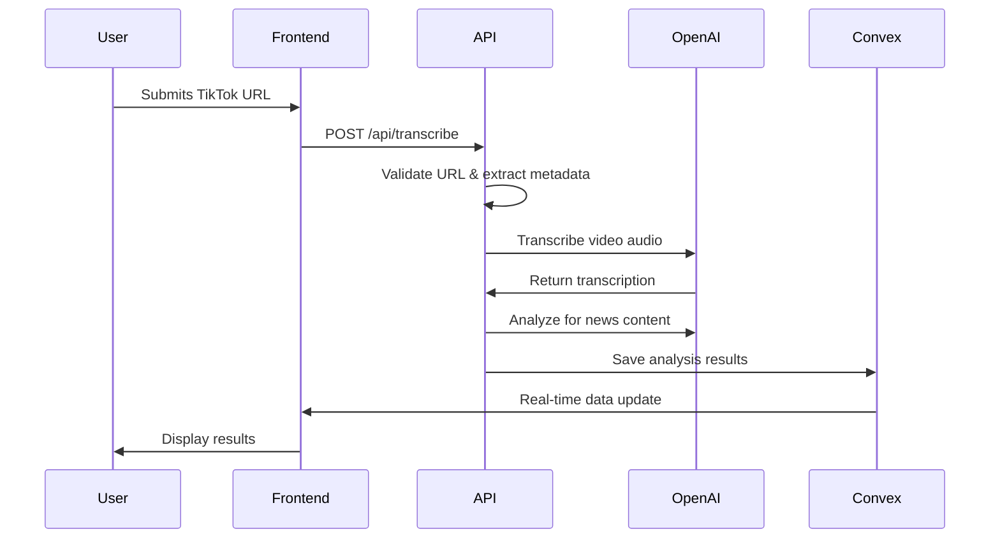

# Developer Onboarding Guide

Welcome to the Checkmate project! This guide will help you get up and running as a new developer on the team.

## Prerequisites

Before getting started, make sure you have:

- **Node.js 18+** - [Download here](https://nodejs.org/)
- **Git** - [Download here](https://git-scm.com/)
- **VS Code** (recommended) - [Download here](https://code.visualstudio.com/)
- **Basic knowledge of:**
  - TypeScript/JavaScript
  - React and Next.js
  - Database concepts

## Quick Start (5 minutes)

### 1. Clone and Setup

```bash
# Clone the repository
git clone https://github.com/your-org/checkmate
cd checkmate

# Install dependencies
npm install

# Copy environment template
cp .env.example .env.local
```

### 2. Configure Environment

Add these required values to `.env.local`:

```bash
# Get from OpenAI
OPENAI_API_KEY=sk-...

# Get from Firecrawl
FIRECRAWL_API_KEY=fc-...

# Get from Clerk Dashboard
CLERK_SECRET_KEY=sk_...
NEXT_PUBLIC_CLERK_PUBLISHABLE_KEY=pk_...

# Get from Convex Dashboard
CONVEX_DEPLOYMENT=dev:...
NEXT_PUBLIC_CONVEX_URL=https://...convex.cloud
```

### 3. Start Development

```bash
# Terminal 1: Start Convex backend
npx convex dev

# Terminal 2: Start Next.js frontend
npm run dev
```

Visit `http://localhost:3000` - you should see the Checkmate homepage!

## Understanding the Project

### What is Checkmate?

Checkmate is a fact-checking platform that:

- Analyzes TikTok videos , tweets and articles for misinformation
- Transcribes video content using AI
- Fact-checks claims against reliable sources
- Tracks content creator credibility scores
- Provides browser extension for quick analysis

### Technology Overview

- **Frontend:** Next.js 15 + TypeScript + Tailwind CSS
- **Backend:** Convex (serverless database + API)
- **Auth:** Clerk (user management)
- **AI:** OpenAI (transcription + analysis)
- **Scraping:** Firecrawl (web content extraction)

## Project Structure Deep Dive

```
checkmate/
├── 📱 app/                    # Next.js pages and API routes
├── 🧩 components/             # Reusable React components
├── 🛠 lib/                   # Utilities and custom hooks
├── 🗄 convex/                # Database schema and functions
├── 🤖 tools/                 # AI analysis logic
├── 📚 docs/                  # Documentation (you are here!)
├── 📱 checkmate_wrapper_flutter/ # Mobile app
└── 🔌 checkmate-browser-extension/ # Browser extension
```

**Key Directories:**

1. **`app/`** - Next.js App Router pages and API endpoints
2. **`components/`** - UI components organized by feature
3. **`lib/hooks/`** - Custom React hooks for data operations
4. **`convex/`** - Backend database, auth, and API functions
5. **`tools/`** - AI-powered analysis and fact-checking logic

## Data Flow Understanding

### 1. Video Analysis Process



### 2. Real-time Data Sync

Convex provides real-time synchronization:

- Database changes automatically sync to all connected clients
- React hooks re-render components when data updates
- No manual refresh needed - everything stays in sync

## Core Concepts

### 1. Database Schema (Convex)

**4 Main Tables:**

- **`users`** - User accounts (synced from Clerk)
- **`tiktokAnalyses`** - Video analysis results
- **`contentCreators`** - Creator credibility tracking
- **`creatorComments`** - User feedback on creators

### 2. Custom Hooks Pattern

We use custom hooks to encapsulate database operations:

```typescript
// ✅ Good: Use custom hooks
function MyComponent() {
  const analyses = useUserTikTokAnalyses();
  const deleteAnalysis = useDeleteTikTokAnalysis();

  // Component logic...
}

// ❌ Avoid: Direct Convex calls in components
function MyComponent() {
  const analyses = useQuery(api.tiktokAnalyses.getUserTikTokAnalyses);
  // Less maintainable...
}
```

### 3. Component Organization

Components are organized by responsibility:

- **`components/ui/`** - Base UI primitives (buttons, cards, etc.)
- **`components/analysis/`** - Analysis-specific components
- **`components/creator/`** - Creator profile components
- **`components/news/`** - News dashboard components

## Development Workflow

### 1. Making Changes

**Always follow this pattern:**

1. **Create a feature branch**

   ```bash
   git checkout -b feature/your-feature-name
   ```

2. **Make your changes** following our patterns
3. **Test your changes** locally
4. **Commit with descriptive messages**

   ```bash
   git commit -m "feat: add creator credibility display component"
   ```

5. **Push and create PR**
   ```bash
   git push origin feature/your-feature-name
   ```

### 2. Database Changes

When modifying the database schema:

1. **Update `convex/schema.ts`**
2. **Run `npx convex dev`** to apply changes
3. **Update TypeScript types** if needed
4. **Test with real data**

### 3. Adding New Features

**Example: Adding a new analysis type**

1. **Update schema** - Add fields to `tiktokAnalyses` table
2. **Create backend functions** - Add queries/mutations in `convex/`
3. **Create hooks** - Add custom hooks in `lib/hooks/`
4. **Build components** - Create UI components
5. **Add to pages** - Integrate into existing pages

## Common Tasks

### Adding a New Component

```bash
# Create component file
touch components/analysis/my-new-component.tsx

# Add to index file for easy imports
echo "export { MyNewComponent } from './my-new-component';" >> components/analysis/index.ts
```

### Creating a Database Query

```typescript
// In convex/myQueries.ts
export const getMyData = query({
  args: { userId: v.id("users") },
  handler: async (ctx, args) => {
    // Verify authentication
    const identity = await ctx.auth.getUserIdentity();
    if (!identity) return null;

    // Query database
    return await ctx.db
      .query("myTable")
      .withIndex("by_user", (q) => q.eq("userId", args.userId))
      .collect();
  },
});
```

### Creating a Custom Hook

```typescript
// In lib/hooks/use-my-data.ts
export function useMyData() {
  return useQuery(api.myQueries.getMyData);
}
```

### Adding a New Page

```bash
# Create page file
mkdir -p app/my-page
touch app/my-page/page.tsx

# Add page content
echo "export default function MyPage() { return <div>My Page</div>; }" > app/my-page/page.tsx
```

## Code Style & Best Practices

### 1. TypeScript Guidelines

- **Always use TypeScript** - No plain JavaScript files
- **Import types properly**:
  ```typescript
  import type { Doc } from "@/convex/_generated/dataModel";
  import { Id } from "@/convex/_generated/dataModel";
  ```
- **Use proper type annotations** for function parameters and returns

### 2. Component Guidelines

- **Functional components only** - No class components
- **Use hooks for state** - useState, useEffect, custom hooks
- **Props interface** for all components:

  ```typescript
  interface MyComponentProps {
    title: string;
    onSave: () => void;
  }

  export function MyComponent({ title, onSave }: MyComponentProps) {
    // Component logic
  }
  ```

### 3. Database Guidelines

- **Use indexes** for all filtered queries
- **Validate inputs** with Convex validators
- **Handle authentication** in all mutations
- **Provide error messages** for failures

### 4. Performance Guidelines

- **Limit query results** with `.take(n)`
- **Use pagination** for large datasets
- **Memoize expensive calculations** with `useMemo`
- **Lazy load** components when possible

## Debugging & Troubleshooting

### Common Issues

**1. "Convex function not found"**

```bash
# Solution: Restart Convex dev server
npx convex dev
```

**2. "Authentication error"**

```bash
# Solution: Check Clerk configuration in .env.local
# Ensure CLERK_SECRET_KEY and NEXT_PUBLIC_CLERK_PUBLISHABLE_KEY are set
```

**3. "Module not found"**

```bash
# Solution: Clear Node modules and reinstall
rm -rf node_modules package-lock.json
npm install
```

### Debugging Tools

1. **Convex Dashboard** - View database and function logs
2. **React DevTools** - Inspect component state and props
3. **Network Tab** - Monitor API requests and responses
4. **Clerk Dashboard** - Debug authentication issues

### Getting Help

1. **Check documentation** - Refer to guides in `docs/`
2. **Search existing issues** - Look for similar problems in GitHub
3. **Ask team members** - Use Slack or create a discussion
4. **Create detailed bug reports** - Include error messages and steps to reproduce

## Next Steps

Now that you're set up, dive deeper into specific areas:

1. **📖 [Architecture Guide](./ARCHITECTURE_GUIDE.md)** - Understand the overall system design
2. **🎣 [Hooks Guide](./HOOKS_GUIDE.md)** - Learn about our custom React hooks
3. **🗄 [Database Guide](./DATABASE_GUIDE.md)** - Master the Convex database operations
4. **🔌 [API Guide](./API_GUIDE.md)** - Explore the API endpoints and interfaces

## Development Resources

### Official Documentation

- [Next.js Docs](https://nextjs.org/docs)
- [Convex Docs](https://docs.convex.dev/)
- [Clerk Docs](https://clerk.com/docs)
- [Tailwind CSS](https://tailwindcss.com/docs)

### Internal Resources

- **Code Examples** - Check existing components for patterns
- **Team Wiki** - Internal knowledge base (link TBD)
- **Design System** - UI component library in `components/ui/`

### Useful Extensions (VS Code)

```bash
# Install recommended extensions
code --install-extension bradlc.vscode-tailwindcss
code --install-extension ms-vscode.vscode-typescript-next
code --install-extension esbenp.prettier-vscode
code --install-extension ms-vscode.vscode-eslint
```

## Project Context

### Mission

Help users identify misinformation in social media content through AI-powered analysis and community-driven credibility tracking.

### Goals

- **Accuracy** - Provide reliable fact-checking results
- **Speed** - Fast analysis and real-time updates
- **Usability** - Intuitive interface for all users
- **Scalability** - Handle growing user base and content volume

### Success Metrics

- Analysis completion rate
- Fact-check accuracy
- User engagement and retention
- Creator credibility score reliability

Welcome to the team! 🎉 Feel free to ask questions and contribute to making Checkmate even better.
