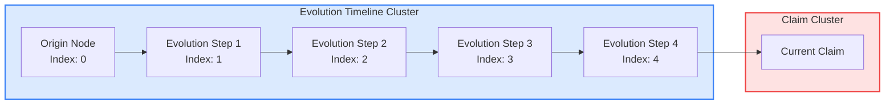

# Evolution Timeline Flow Diagram

## Sequential Node Layout

The evolution timeline creates a proper sequential flow from origin through evolution steps to the current claim:



## Layout Algorithm

### For ≤3 Nodes (Single Row):
```
[Origin] --380px-- [Evolution 1] --380px-- [Evolution 2]
```

### For >3 Nodes (Two Rows - Sequential Wrapping):
```
Row 1: [Origin] --380px-- [Evo 1] --380px-- [Evo 2] --380px-- [Evo 3]
         ↓ 260px
Row 2: [Evo 4] --380px-- [Evo 5] --380px-- [Evo 6]
```

The nodes wrap sequentially from row 1 to row 2, maintaining chronological order left-to-right, top-to-bottom.

## Spacing Guarantees

- **Horizontal**: 380px between node centers (320px node + 60px gap)
- **Vertical**: 260px between row centers (140px node + 120px gap)
- **Cluster width**: `nodesPerRow × 380 + 200px` (padding)
- **Cluster height**: `rows × 260 + 140px` (padding)

## Overlap Prevention

1. **Fixed Grid Layout**: Each node gets exact position based on index
2. **3-Pass Resolution**: Checks all node pairs, pushes apart if < 380px (same cluster) or < 340px (different clusters)
3. **Bidirectional Push**: Both nodes move apart equally to maintain layout balance

## Example with 6 Nodes:

```
Evolution Cluster (1200px × 660px)
┌────────────────────────────────────────────────────────┐
│  Evolution Timeline                                     │
│                                                         │
│  ●──────380px──────●──────380px──────●                │
│  Origin          Step 1            Step 2              │
│                                                         │
│      260px                                              │
│                                                         │
│  ●──────380px──────●──────380px──────●                │
│  Step 3          Step 4            Step 5              │
│                                                         │
└────────────────────────────────────────────────────────┘
                           │
                           │ connects to
                           ▼
                    ┌──────────┐
                    │  Claim   │
                    └──────────┘
```

## Node Order Preservation

The order of nodes in the `evolutionClusterNodes` array determines the visual left-to-right, top-to-bottom sequence:

1. `originNodeId` (if exists) - leftmost position
2. `evolutionNodes[0]` - next position
3. `evolutionNodes[1]` - next position
4. ... continuing sequentially
5. Final evolution node connects to claim

This ensures the chronological narrative flows naturally through the diagram.

