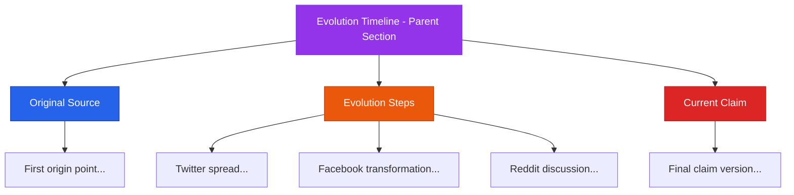

# Evolution Timeline Navigation Structure

## Overview

The right navigation pane now shows a nested structure for the Evolution Timeline, displaying the complete journey of information from its original source through evolution steps to the current claim.

## Visual Structure



## Navigation Hierarchy

### Before (Flat Structure)
```
▼ Origin                     [1]
  • First origin point...
  
▼ Evolution Timeline         [5]
  • Twitter spread...
  • Facebook transformation...
  • Reddit discussion...
  • YouTube amplification...
  • TikTok viral...

▼ Belief Drivers             [3]
▼ Fact-Check Sources         [8]
```

### After (Nested Structure)
```
▼ Evolution Timeline                    [7]
  ├─▼ Original Source                   [1]
  │   └─• First origin point...
  │
  ├─▼ Evolution Steps                   [5]
  │   ├─• Twitter spread...
  │   ├─• Facebook transformation...
  │   ├─• Reddit discussion...
  │   ├─• YouTube amplification...
  │   └─• TikTok viral...
  │
  └─▼ Current Claim                     [1]
      └─• Final claim version...

▼ Belief Drivers                        [3]
▼ Fact-Check Sources                    [8]
```

## Key Features

1. **Nested Subsections**: Evolution Timeline now contains three logical subsections
2. **Visual Hierarchy**: 
   - Subsections are indented with a connecting border line
   - Items within subsections have additional indentation
3. **Smart Count Badges**: Parent section shows total count across all subsections
4. **Individual Expansion**: Each subsection can be independently expanded/collapsed
5. **Preserved Functionality**: All animation, focus, and click behaviors work as before

## Implementation Details

### Type Changes
- Added `subsections?: NavSection[]` to the `NavSection` interface
- Allows recursive nesting of sections

### Data Structure
- **Original Source**: Contains origin nodes (type === 'origin')
- **Evolution Steps**: Contains evolution and propagation nodes
- **Current Claim**: Contains claim nodes (type === 'claim')

### Visual Design
- Subsection headers use lighter colors and smaller fonts
- Tree-line connectors (border-left) show nesting relationship
- Background colors differentiate nested levels
- All hover, focus, and animation states preserved

## Color Scheme

| Section | Color |
|---------|-------|
| Evolution Timeline (Parent) | Purple (`text-purple-600`) |
| Original Source | Blue (`text-blue-600`) |
| Evolution Steps | Orange (`text-orange-600`) |
| Current Claim | Red (`text-red-600`) |
| Belief Drivers | Violet (`text-violet-600`) |
| Fact-Check Sources | Emerald (`text-emerald-600`) |

