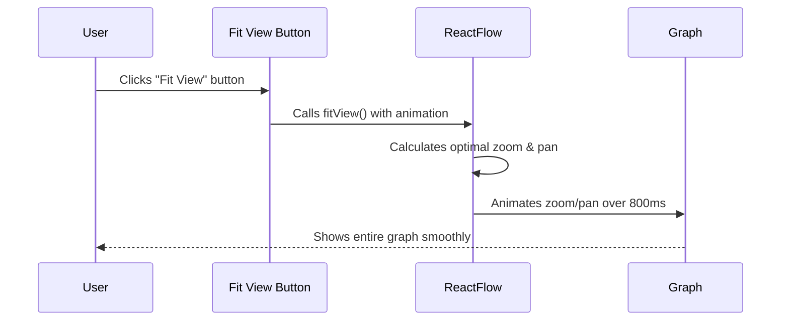
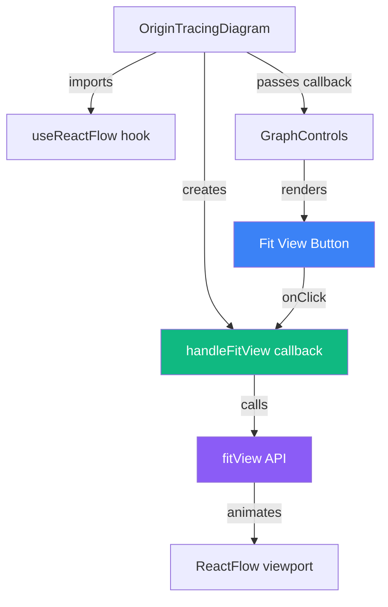
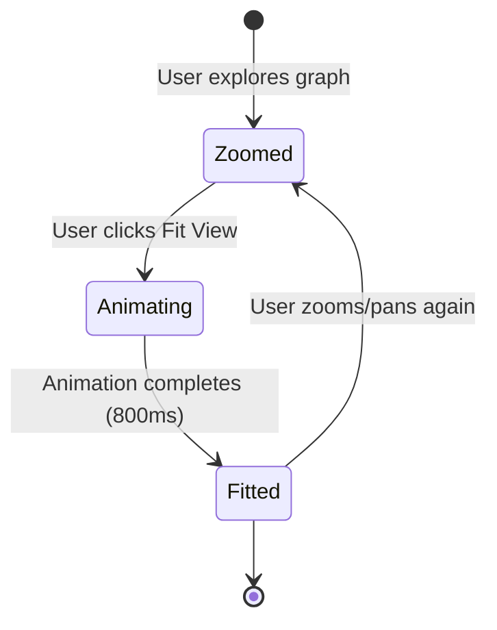

# Fit View Feature

## Overview

The Fit View feature allows users to smoothly zoom and pan the origin tracing diagram to fit the entire graph within the viewport. This provides an optimal viewing experience regardless of the current zoom level or pan position.

**Note**: The on-canvas ReactFlow controls have been removed. All graph controls (including Fit View, Fullscreen, and Animation controls) are now consolidated in the top header bar for a cleaner, more streamlined interface.

## User Flow



## Component Architecture



## Technical Implementation

### 1. GraphControls Component

The `GraphControls` component now accepts an `onFitView` prop and renders a "Fit View" button:

```tsx
interface GraphControlsProps {
  // ... other props
  onFitView: () => void;
}

<Button
  size="sm"
  variant="outline"
  onClick={onFitView}
  title="Fit graph to view"
>
  <Maximize className="h-3.5 w-3.5 mr-1.5" />
  Fit View
</Button>
```

### 2. OriginTracingDiagram Component

The main diagram component uses ReactFlow's `useReactFlow` hook to access the `fitView` API:

```tsx
function OriginTracingDiagramInternal() {
  const { fitView } = useReactFlow();
  
  // Smooth fit view handler with animation
  const handleFitView = useCallback(() => {
    fitView({
      padding: 0.15,           // 15% padding around graph
      includeHiddenNodes: false, // Only visible nodes
      minZoom: 0.2,             // Minimum zoom level
      maxZoom: 1.2,             // Maximum zoom level
      duration: 800,            // 800ms smooth animation
    });
  }, [fitView]);
  
  return (
    <GraphControls onFitView={handleFitView} />
  );
}
```

## Fit View Options

| Option | Value | Description |
|--------|-------|-------------|
| `padding` | `0.15` | Adds 15% padding around the graph for better visibility |
| `includeHiddenNodes` | `false` | Only considers visible nodes when calculating bounds |
| `minZoom` | `0.2` | Prevents zooming out too far |
| `maxZoom` | `1.2` | Prevents zooming in too close |
| `duration` | `800` | Smooth 800ms animation transition |

## User Experience Benefits

1. **Quick Navigation**: Users can instantly return to an overview of the entire graph
2. **Smooth Animation**: 800ms duration provides a pleasant, non-jarring transition
3. **Optimal Framing**: 15% padding ensures the graph isn't cramped against edges
4. **Consistent Behavior**: Works in both normal and fullscreen modes
5. **Clean Interface**: All controls centralized in header - no floating UI elements on canvas

## Use Cases

- **Initial Load**: After exploring individual nodes, quickly return to overview
- **Lost Context**: When zoomed in too far and need to see the big picture
- **Presentation**: Reset view to show the complete graph to others
- **After Resize**: Reframe graph after changing window size or entering fullscreen

## Visual States



## Integration with Other Features

The Fit View button works seamlessly with:
- **Fullscreen Mode**: Available in both normal and fullscreen views
- **Animation Controls**: Can be used during or after animation playback
- **Node Selection**: Reframes view while maintaining node selection
- **Sidebar Navigation**: Complements navigation by showing full context

## Future Enhancements

Potential improvements for the Fit View feature:
1. **Keyboard Shortcut**: Add hotkey (e.g., `Ctrl/Cmd + F`) for power users
2. **Auto-Fit on Load**: Option to automatically fit view on initial render
3. **Fit to Selection**: Add ability to fit view to selected nodes only
4. **Smooth Follow**: Automatically fit view when new nodes are added

