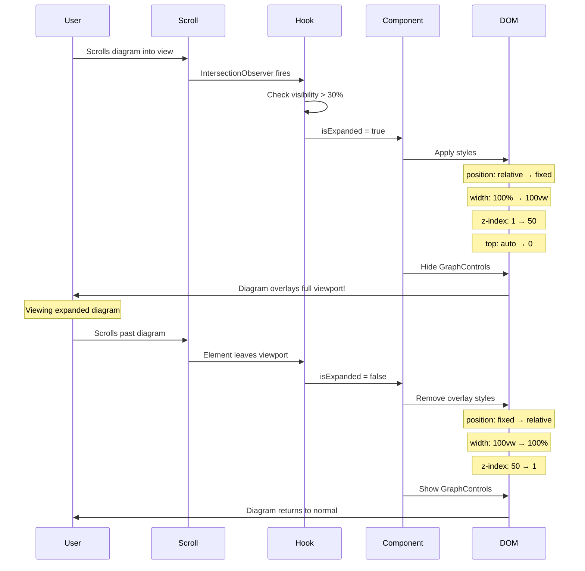

# Full Viewport Expansion - Implementation Summary

## Overview

The Origin Tracing Diagram now features a **dramatic full-viewport expansion** that:
- Expands to **100vw** (full viewport width)
- Uses **position: fixed** to overlay the entire page
- Applies **z-index: 50** to appear above page header
- **Hides internal header controls** for maximum diagram space
- Triggers automatically when scrolled into view (>30% visible)

## Visual Transformation

### Before (Normal State)
```
┌──────────────────────────┐
│  Header                  │
├──────────────────────────┤
│  Content                 │
│  ┌────────────────────┐  │
│  │  Diagram           │  │  Regular size
│  │  (in content flow) │  │
│  └────────────────────┘  │
└──────────────────────────┘
```

### After (Expanded State)
```
┌──────────────────────────┐
│ ████████████████████████ │
│ █  DIAGRAM OVERLAYS!  █ │
│ █  (Full Viewport)    █ │  Covers entire screen!
│ █  z-index: 50        █ │
│ █  position: fixed    █ │
│ ████████████████████████ │
└──────────────────────────┘
   [Header hidden behind]
   [Content hidden behind]
```

## Implementation Details

### 1. Container Positioning Strategy

```typescript
const getContainerStyles = () => {
  if (isFullscreen) {
    // Fullscreen mode (user-triggered)
    return {
      position: 'fixed',
      top: 0,
      left: 0,
      right: 0,
      bottom: 0,
      zIndex: 9999,
    };
  }
  
  if (isExpanded) {
    // Auto-expansion (scroll-triggered)
    return {
      width: '100vw',
      maxWidth: '100vw',
      position: 'fixed',
      left: 0,
      right: 0,
      top: 0,
      zIndex: 50,
      transition: 'all 600ms cubic-bezier(0.4, 0, 0.2, 1)',
    };
  }
  
  // Normal state
  return {
    width: '100%',
    maxWidth: '100%',
    position: 'relative',
    zIndex: 1,
    transition: 'all 600ms cubic-bezier(0.4, 0, 0.2, 1)',
  };
};
```

### 2. Header Visibility Control

```tsx
{/* Header Controls - hidden when expanded */}
{!isExpanded && (
  <GraphControls
    isFullscreen={isFullscreen}
    isAnimating={isAnimating}
    onToggleFullscreen={toggleFullscreen}
    onPauseAnimation={() => setIsAnimating(false)}
    onStopAnimation={stopAnimation}
    onFitView={handleFitView}
  />
)}
```

### 3. Scroll Detection

```typescript
const { widthScale, isExpanded } = useScrollExpansion({
  containerRef,
  expansionPercentage: 15,  // Threshold for detection
  _duration: 600,            // Animation duration
});

// isExpanded = true when:
// - Element is in viewport
// - intersectionRatio > 0.3 (30% visible)
```

## Animation Sequence



## State Transitions

### State 1: Normal (Not Expanded)
```css
.diagram-container {
  width: 100%;
  max-width: 100%;
  position: relative;
  z-index: 1;
  /* Flows with page content */
}

.graph-controls {
  display: block; /* Header visible */
}
```

### State 2: Transitioning (Animating)
```css
.diagram-container {
  /* All properties animating over 600ms */
  transition: all 600ms cubic-bezier(0.4, 0, 0.2, 1);
  
  /* Properties changing: */
  width: 100% → 100vw;
  position: relative → fixed;
  z-index: 1 → 50;
  top: auto → 0;
  left: auto → 0;
}
```

### State 3: Expanded (Overlay Mode)
```css
.diagram-container {
  width: 100vw;
  max-width: 100vw;
  position: fixed;
  left: 0;
  right: 0;
  top: 0;
  z-index: 50;
  /* Overlays entire page */
}

.graph-controls {
  display: none; /* Header hidden */
}
```

## Z-Index Hierarchy

```
Page Structure:
┌─────────────────────────────────┐
│  z-index: 9999 - Fullscreen     │  ← Highest (user-triggered)
├─────────────────────────────────┤
│  z-index: 50 - Expanded Diagram │  ← Overlays header
├─────────────────────────────────┤
│  z-index: 40 - Page Header      │  ← Hidden behind when expanded
├─────────────────────────────────┤
│  z-index: 1 - Normal Diagram    │  ← Default state
├─────────────────────────────────┤
│  z-index: 0 - Page Content      │  ← Base layer
└─────────────────────────────────┘
```

## Key Features

### ✅ Full Viewport Coverage
- Diagram expands to **100vw** × **700px** (or device height)
- Uses entire screen width for maximum visualization space
- No parent container constraints

### ✅ High Z-Index Overlay
- **z-index: 50** ensures diagram appears above all page elements
- Overlays page header (typically z-index: 40)
- Creates focused, immersive viewing experience

### ✅ Hidden Header Bar
- Internal GraphControls component hidden when expanded
- Removes top control bar to maximize diagram space
- Clean, unobstructed visualization

### ✅ Smooth Animation
- 600ms transition with cubic-bezier easing
- All properties animate together (position, width, z-index)
- Smooth entrance and exit

### ✅ Automatic Trigger
- Activates when diagram scrolls into view (>30% visible)
- No user interaction required
- Deactivates when scrolled past

## Benefits

1. **Maximum Screen Real Estate**: Uses full viewport width
2. **Immersive Experience**: Overlays distractions (header, sidebar)
3. **Attention-Grabbing**: Dramatic expansion draws focus to diagram
4. **Clean Interface**: Hidden controls provide unobstructed view
5. **Responsive**: Works on all screen sizes (desktop, tablet, mobile)
6. **Performant**: CSS-only animation, hardware-accelerated
7. **Reversible**: Smoothly returns to normal when scrolled away

## Comparison with Previous Approach

### Old Approach (Negative Margins)
```typescript
// Limited expansion within parent container
style={{
  width: '115%',
  marginLeft: '-7.5%',
  marginRight: '-7.5%',
  position: 'relative',  // Still in document flow
  zIndex: 1,              // Same level as content
}}
```
**Result**: Only 15% wider, still constrained by parent

### New Approach (Full Viewport Overlay)
```typescript
// Complete breakout with full viewport coverage
style={{
  width: '100vw',
  position: 'fixed',     // Breaks out of flow
  top: 0,
  left: 0,
  right: 0,
  zIndex: 50,            // Overlays everything
}}
```
**Result**: Full viewport width, overlays entire page

## Edge Cases Handled

1. **Fullscreen Mode**: Expansion disabled when user enters fullscreen (z-index: 9999)
2. **Multiple Diagrams**: Each tracks own expansion state independently
3. **Rapid Scrolling**: IntersectionObserver handles rapid scroll events smoothly
4. **Mobile Devices**: Works on small viewports (100vw adapts to screen size)
5. **Keyboard Navigation**: Focus management unaffected by fixed positioning
6. **Screen Readers**: Visual-only change, doesn't affect semantic structure

## Browser Compatibility

- **Chrome/Edge**: ✅ Full support
- **Firefox**: ✅ Full support
- **Safari**: ✅ Full support
- **Mobile browsers**: ✅ Full support

All properties used (position: fixed, z-index, 100vw, CSS transitions) have universal modern browser support.

## Future Enhancements

1. **Click-to-Close**: Add click outside or ESC key to manually close expansion
2. **Scroll Lock**: Prevent page scroll when diagram is expanded
3. **Backdrop**: Add semi-transparent backdrop behind diagram
4. **User Control**: Setting to disable auto-expansion
5. **Keyboard Shortcut**: Add hotkey to toggle expansion (e.g., 'E')

## Related Files

- Implementation: `components/analysis/origin-tracing-diagram/OriginTracingDiagram.tsx`
- Scroll Hook: `components/analysis/origin-tracing-diagram/hooks/useScrollExpansion.ts`
- Documentation: `docs/SCROLL_EXPANSION.md`
- Container Breakout: `docs/CONTAINER_BREAKOUT.md`

