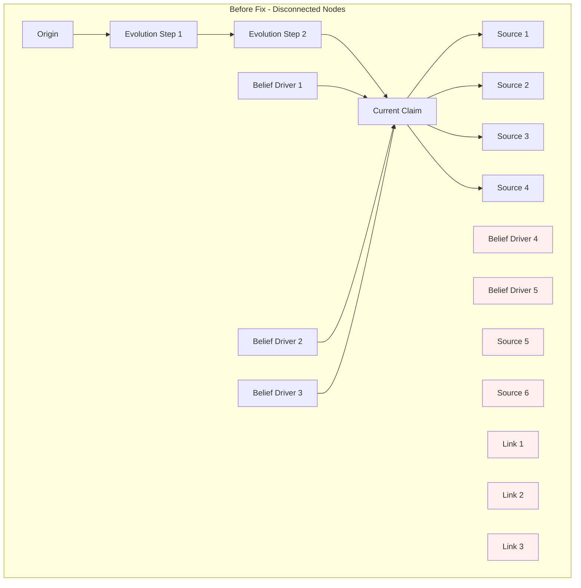
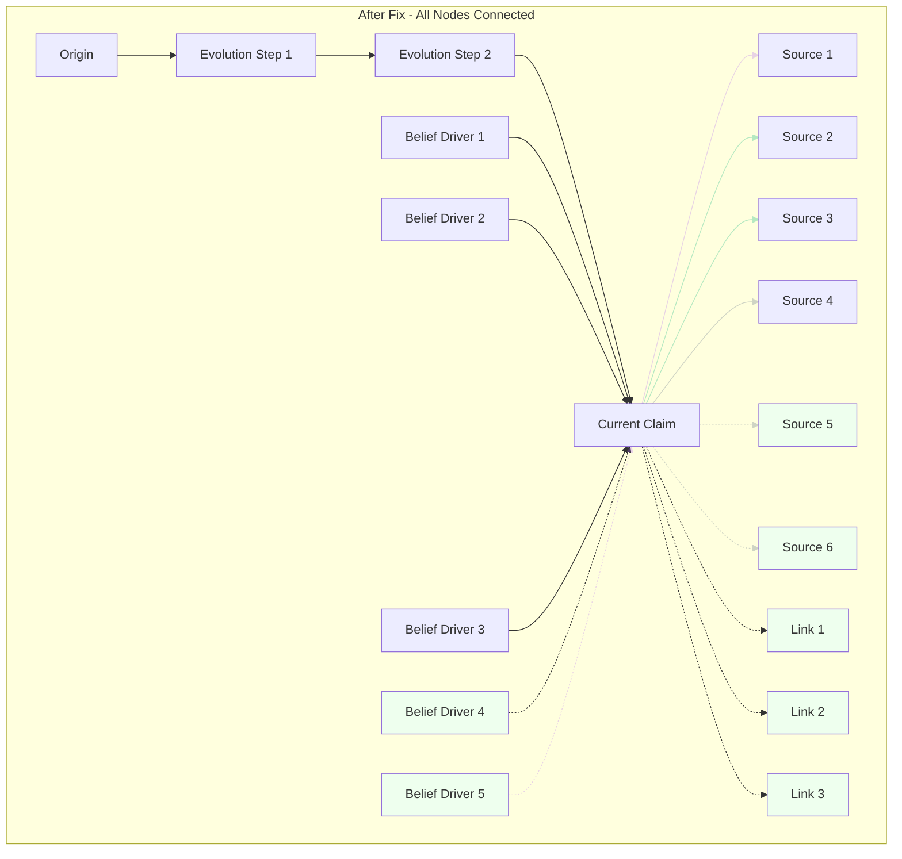

# Node Connection Fix

## Problem

Several nodes in the origin tracing diagram were not connected to any other nodes, appearing as isolated elements:

1. **All Link Nodes** - Completely disconnected (0 connections)
2. **Source Nodes beyond index 4** - Created but not connected
3. **Belief Driver Nodes beyond index 3** - Created but not connected

## Root Cause

The graph building logic in `useOriginTracingGraph.ts` had conditional edge creation that only connected a subset of nodes to reduce visual clutter, but this resulted in orphaned nodes.



## Solution

Connect **all nodes** to the graph, but use visual hierarchy to emphasize important connections:

### Visual Hierarchy Strategy

1. **Primary Connections** (Top priority)
   - Solid lines
   - Higher opacity (0.5-0.7)
   - Thicker stroke width (1.5-2px)

2. **Secondary Connections** (Lower priority)
   - Dashed lines (`strokeDasharray: '5,5'`)
   - Lower opacity (0.25-0.3)
   - Thinner stroke width (1px)



## Changes Made

### 1. Belief Drivers (Lines 289-306)

**Before:**
```typescript
// Only show first 3 belief driver connections to reduce clutter
if (index < 3) {
  edges.push({...});
}
```

**After:**
```typescript
// Connect all belief drivers with visual emphasis on top ones
const isPrimary = index < 3;
edges.push({
  id: `${driverNodeId}-${currentClaimNodeId}`,
  source: driverNodeId,
  sourceHandle: 'bottom',
  target: currentClaimNodeId,
  targetHandle: 'top',
  type: 'default',
  markerEnd: { type: MarkerType.ArrowClosed },
  label: index === 0 ? 'influences' : '',
  style: { 
    stroke: '#a855f7', 
    strokeWidth: index === 0 ? 2 : isPrimary ? 1.5 : 1,
    opacity: index === 0 ? 0.7 : isPrimary ? 0.4 : 0.25,
    strokeDasharray: isPrimary ? undefined : '5,5'  // Dashed for secondary
  },
});
```

### 2. Fact-Check Sources (Lines 333-350)

**Before:**
```typescript
// Only show top 4 sources to reduce clutter
if (index < 4) {
  edges.push({...});
}
```

**After:**
```typescript
// Connect all sources with visual emphasis on top credible ones
const isPrimary = index < 4;
edges.push({
  id: `${currentClaimNodeId}-${sourceNodeId}`,
  source: currentClaimNodeId,
  sourceHandle: 'bottom',
  target: sourceNodeId,
  targetHandle: 'top',
  type: 'default',
  markerEnd: { type: MarkerType.ArrowClosed },
  label: index === 0 ? 'fact-checked by' : '',
  style: { 
    stroke: '#10b981', 
    strokeWidth: isPrimary && source.credibility >= 80 ? 2 : isPrimary ? 1.5 : 1,
    opacity: isPrimary && source.credibility >= 80 ? 0.7 : isPrimary ? 0.5 : 0.3,
    strokeDasharray: isPrimary ? undefined : '5,5'  // Dashed for secondary
  },
});
```

### 3. Reference Links (Lines 387-403)

**Before:**
```typescript
// No edges created - nodes completely disconnected!
```

**After:**
```typescript
// Connect all links to claim node for reference context
edges.push({
  id: `${currentClaimNodeId}-${linkNodeId}`,
  source: currentClaimNodeId,
  sourceHandle: 'bottom',
  target: linkNodeId,
  targetHandle: 'top',
  type: 'default',
  markerEnd: { type: MarkerType.ArrowClosed },
  label: index === 0 ? 'references' : '',
  style: { 
    stroke: '#64748b',      // Gray color for references
    strokeWidth: 1,         // Thin line
    opacity: 0.3,           // Low opacity
    strokeDasharray: '5,5'  // Dashed
  },
});
```

## Benefits

✅ **No Disconnected Nodes** - All nodes are now part of the graph
✅ **Visual Hierarchy** - Important connections stand out with solid, bold lines
✅ **Reduced Clutter** - Secondary connections use subtle, dashed lines
✅ **Better UX** - Users can see all relationships without confusion
✅ **Semantic Meaning** - Dashed lines indicate less important or reference connections

## Edge Styling Summary

| Node Type | Index Range | Stroke Width | Opacity | Dash Style | Color |
|-----------|-------------|--------------|---------|------------|-------|
| Belief Drivers (Primary) | 0-2 | 1.5-2px | 0.4-0.7 | Solid | Purple (#a855f7) |
| Belief Drivers (Secondary) | 3+ | 1px | 0.25 | Dashed | Purple (#a855f7) |
| Sources (High Credibility) | 0-3, ≥80% | 2px | 0.7 | Solid | Green (#10b981) |
| Sources (Medium) | 0-3, <80% | 1.5px | 0.5 | Solid | Green (#10b981) |
| Sources (Secondary) | 4+ | 1px | 0.3 | Dashed | Green (#10b981) |
| Reference Links | All | 1px | 0.3 | Dashed | Gray (#64748b) |
| Evolution Chain | All | 2-2.5px | 0.7-0.8 | Solid | Orange/Blue |

