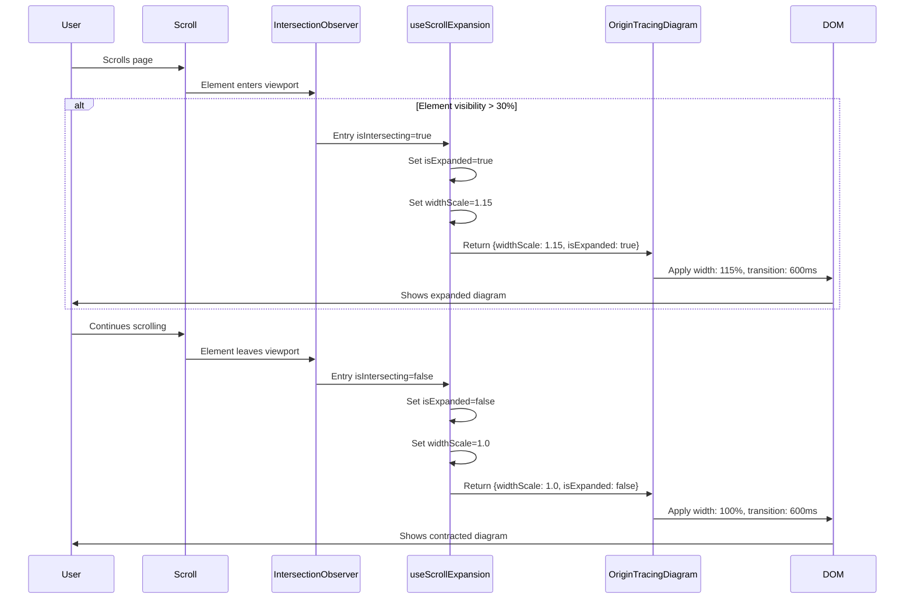
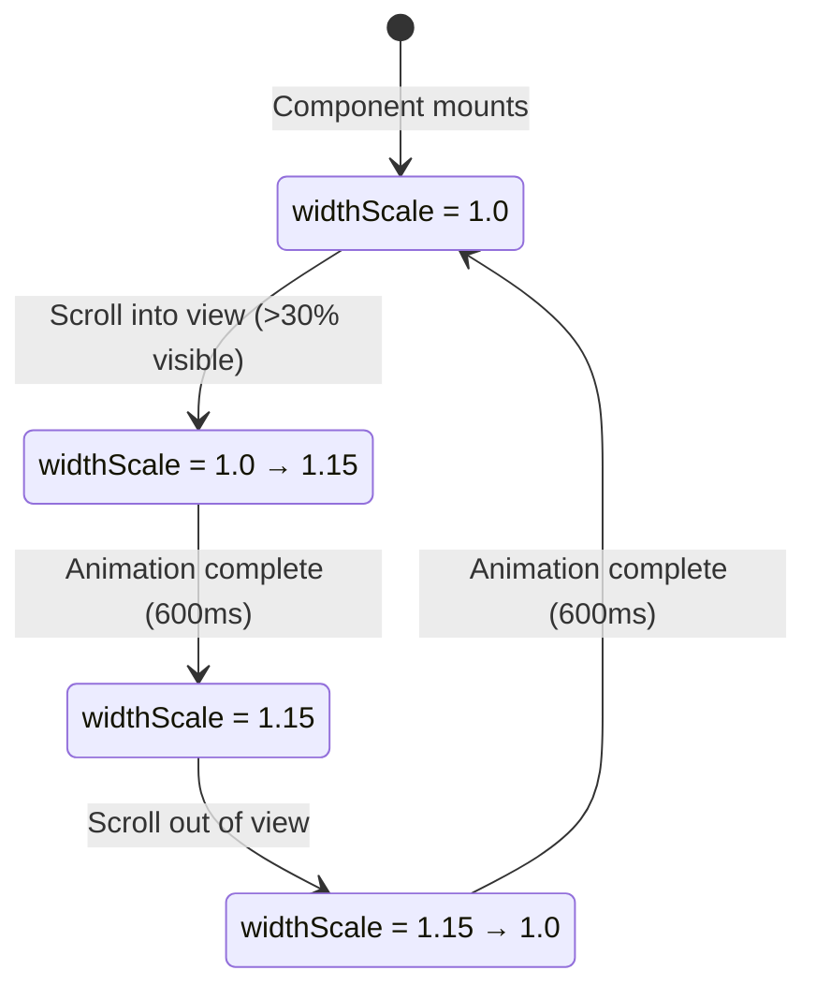
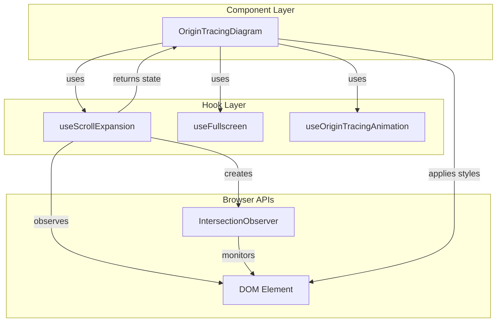
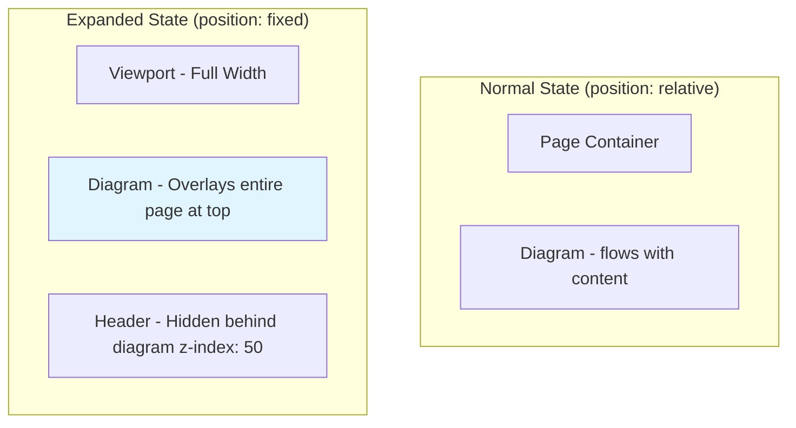
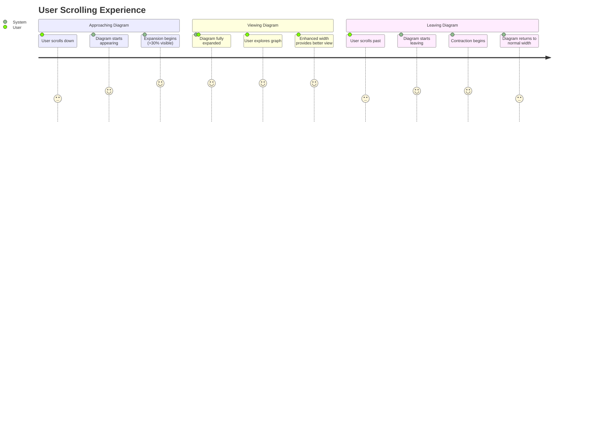

# Scroll-Based Width Expansion for Origin Tracing Diagram

## Overview

The Origin Tracing Diagram features a smooth scroll-based expansion animation that enhances the viewing experience. As users scroll the diagram into view, it expands horizontally to provide a more immersive visualization. When scrolled past, it smoothly contracts back to its original width.

## Flow Diagram



## State Machine



## Architecture



## Technical Details

### Hook: `useScrollExpansion`

**Location:** `components/analysis/origin-tracing-diagram/hooks/useScrollExpansion.ts`

**Purpose:** Detects when the diagram container enters the viewport and triggers width expansion animation.

**Parameters:**
- `containerRef: RefObject<HTMLElement>` - Reference to the diagram container element
- `expansionPercentage?: number` - Percentage to expand width by (default: 15%)
- `duration?: number` - Animation duration in milliseconds (default: 600ms)

**Returns:**
- `widthScale: number` - Current width scale factor (1.0 = normal, 1.15 = 15% wider)
- `isExpanded: boolean` - Whether the element is currently in expanded state

**Implementation Details:**

1. **IntersectionObserver Configuration:**
   ```typescript
   {
     threshold: [0, 0.3, 0.5, 0.7, 1.0],
     rootMargin: '0px 0px -10% 0px'
   }
   ```
   - Triggers at multiple visibility thresholds
   - Adds -10% bottom margin to trigger slightly before full visibility

2. **Visibility Logic:**
   - Element expands when `intersectionRatio > 0.3` (>30% visible)
   - Element contracts when leaving viewport (`isIntersecting = false`)

3. **Scale Calculation:**
   ```typescript
   const maxScale = 1 + expansionPercentage / 100;
   // For 15%: maxScale = 1.15
   ```

### Component Integration

**Location:** `components/analysis/origin-tracing-diagram/OriginTracingDiagram.tsx`

**Usage:**
```typescript
const { widthScale, isExpanded } = useScrollExpansion({
  containerRef,
  expansionPercentage: 15,
  duration: 600,
});
```

**Applied Styles:**
```typescript
// Calculate negative margins to "break out" of parent container
const expansionAmount = (widthScale - 1) * 100; // 15% when widthScale is 1.15
const negativeMargin = isFullscreen ? 0 : -expansionAmount / 2; // -7.5% on each side

style={{
  width: isFullscreen ? '100%' : `${widthScale * 100}%`,
  maxWidth: isFullscreen ? 'none' : `calc(100% + ${expansionAmount}%)`,
  transition: 'width 600ms cubic-bezier(0.4, 0, 0.2, 1), max-width 600ms cubic-bezier(0.4, 0, 0.2, 1), margin 600ms cubic-bezier(0.4, 0, 0.2, 1)',
  marginLeft: isFullscreen ? '0' : `${negativeMargin}%`,
  marginRight: isFullscreen ? '0' : `${negativeMargin}%`,
  position: 'relative',
}}
```

## Animation Characteristics

### Easing Function
- **Cubic Bezier:** `cubic-bezier(0.4, 0, 0.2, 1)`
- **Type:** Ease-in-out with slight acceleration
- **Result:** Smooth, natural-feeling expansion/contraction

### Duration
- **600ms** - Balanced between being noticeable and not distracting
- Long enough to be smooth
- Short enough to feel responsive

### Expansion Amount
- **Full Viewport:** Expands to 100vw (full viewport width)
- **Position:** Changes from `relative` to `fixed` at `top: 0, left: 0`
- **Z-Index:** Elevated to `z-index: 50` to overlay page header
- **Header:** Top control bar is hidden during expansion for maximum space

## Container Breakout Technique

The diagram uses **fixed positioning with full viewport width** to completely break out and overlay the page:



### How It Works

1. **Detect Expansion State:**
   ```typescript
   const { isExpanded } = useScrollExpansion({
     containerRef,
     expansionPercentage: 15, // Still used by hook for detection
   });
   // isExpanded = true when diagram >30% visible
   ```

2. **Calculate Container Styles:**
   ```typescript
   const getContainerStyles = () => {
     if (isExpanded) {
       return {
         width: '100vw',           // Full viewport width
         maxWidth: '100vw',        // No restrictions
         position: 'fixed',        // Break out of flow
         left: 0,                  // Align to viewport edge
         right: 0,                 // Span full width
         top: 0,                   // Stick to top
         zIndex: 50,               // Overlay header (z-index: 40)
       };
     }
     
     // Normal state
     return {
       width: '100%',
       position: 'relative',
       zIndex: 1,
     };
   };
   ```

3. **Hide Header Controls:**
   ```typescript
   {!isExpanded && (
     <GraphControls /* ... */ />
   )}
   // Header hidden when expanded for maximum diagram space
   ```

### Visual Representation

**Normal State (position: relative):**
```
┌─────────────────────────────────────────────────────┐
│  Browser Window                                     │
│  ┌───────────────────────────────────────────────┐ │
│  │  Header (z-index: 40)                         │ │
│  └───────────────────────────────────────────────┘ │
│                                                     │
│  ┌───────────────────────────────────────────────┐ │
│  │  Page Content                                 │ │
│  │                                               │ │
│  │  ┌───────────────────────────────────────┐   │ │
│  │  │  Diagram Container                    │   │ │
│  │  │  (position: relative, z-index: 1)     │   │ │
│  │  └───────────────────────────────────────┘   │ │
│  │                                               │ │
│  └───────────────────────────────────────────────┘ │
└─────────────────────────────────────────────────────┘
```

**Expanded State (position: fixed, full width):**
```
┌─────────────────────────────────────────────────────┐
│  Browser Window                                     │
│ ┌─────────────────────────────────────────────────┐ │
│ │  Diagram Container (OVERLAYS EVERYTHING!)       │ │
│ │  position: fixed                                │ │
│ │  top: 0, left: 0, right: 0                      │ │
│ │  width: 100vw                                   │ │
│ │  z-index: 50                                    │ │
│ │                                                 │ │
│ │  [Header hidden - no GraphControls shown]      │ │
│ │                                                 │ │
│ │  [Full viewport width for maximum diagram]     │ │
│ │                                                 │ │
│ └─────────────────────────────────────────────────┘ │
│                                                     │
│  [Header below: z-index: 40 - not visible]         │
│  [Page content below - diagram overlays it]        │
└─────────────────────────────────────────────────────┘
```

### Why This Approach?

1. **Maximum Impact**: Diagram fills entire viewport width and height
2. **Immersive**: Overlays page header to create focused viewing experience
3. **Clean**: Internal header controls hidden for unobstructed visualization
4. **High Z-Index**: Ensures diagram appears above all page elements
5. **Smooth Transition**: Fixed positioning animates smoothly with CSS transitions
6. **Scroll-Triggered**: Automatically expands when scrolled into view (>30% visible)

## User Experience Flow



## Edge Cases Handled

1. **Fullscreen Mode**
   - Expansion is disabled when in fullscreen
   - Width is always 100% in fullscreen mode
   - Prevents conflicts with fullscreen container sizing

2. **Multiple Rapid Scrolls**
   - IntersectionObserver handles rapid scroll events
   - State updates are batched by React
   - Smooth transition even during rapid scrolling

3. **Initial Mount**
   - Component starts at normal width (widthScale = 1.0)
   - Observer is set up after mount
   - No jarring initial animations

4. **Cleanup**
   - Observer disconnects on component unmount
   - Prevents memory leaks
   - No lingering event listeners

## Performance Considerations

1. **Efficient Observation**
   - Single IntersectionObserver per diagram instance
   - Native browser API - highly optimized
   - No scroll event listeners required

2. **CSS Transitions**
   - Hardware-accelerated transforms
   - Smooth 60fps animations
   - No JavaScript animation loops

3. **Minimal Re-renders**
   - Only two state values: `widthScale` and `isExpanded`
   - State updates only on intersection changes
   - No continuous polling or RAF loops

## Customization

To adjust the expansion behavior:

```typescript
// Increase expansion amount
const { widthScale } = useScrollExpansion({
  containerRef,
  expansionPercentage: 20, // 20% wider
  duration: 600,
});

// Make animation faster
const { widthScale } = useScrollExpansion({
  containerRef,
  expansionPercentage: 15,
  duration: 400, // Faster animation
});
```

## Testing Considerations

1. **Visual Testing**
   - Scroll diagram into view - should expand smoothly
   - Scroll past diagram - should contract smoothly
   - Enter fullscreen - expansion should be disabled
   - Exit fullscreen - expansion should resume

2. **Browser Compatibility**
   - IntersectionObserver is supported in all modern browsers
   - Fallback: Without IntersectionObserver, diagram stays at normal width
   - CSS transitions are widely supported

3. **Accessibility**
   - Animation respects `prefers-reduced-motion` (could be added)
   - No content is hidden or lost during expansion
   - Focus management is unaffected

## Future Enhancements

1. **Respect Reduced Motion Preference**
   ```typescript
   const prefersReducedMotion = window.matchMedia('(prefers-reduced-motion: reduce)').matches;
   const duration = prefersReducedMotion ? 0 : 600;
   ```

2. **Progressive Expansion**
   - Could scale expansion based on intersection ratio
   - Smooth scaling from 1.0 to 1.15 as visibility increases

3. **Configurable Thresholds**
   - Allow customization of visibility threshold
   - Different expansion amounts for different viewport sizes

## Related Files

- Hook implementation: `components/analysis/origin-tracing-diagram/hooks/useScrollExpansion.ts`
- Component usage: `components/analysis/origin-tracing-diagram/OriginTracingDiagram.tsx`
- Hook exports: `components/analysis/origin-tracing-diagram/hooks/index.ts`
- Animation hook: `components/analysis/origin-tracing-diagram/hooks/useOriginTracingAnimation.ts`
- Auto-play documentation: `docs/AUTO_PLAY_ANIMATION.md`

